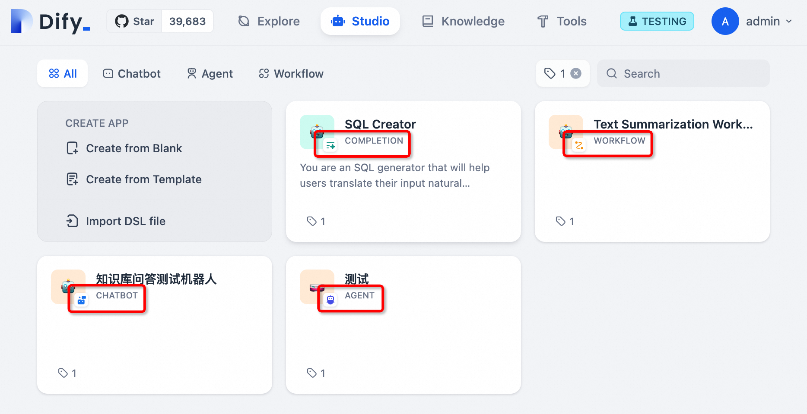
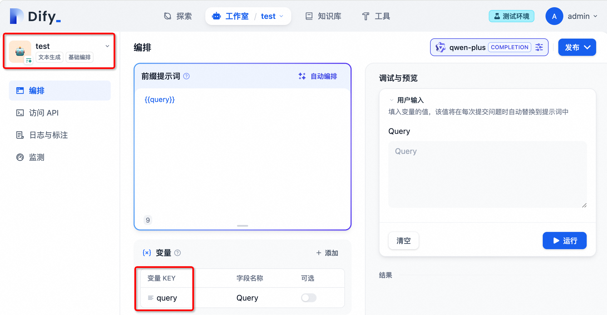
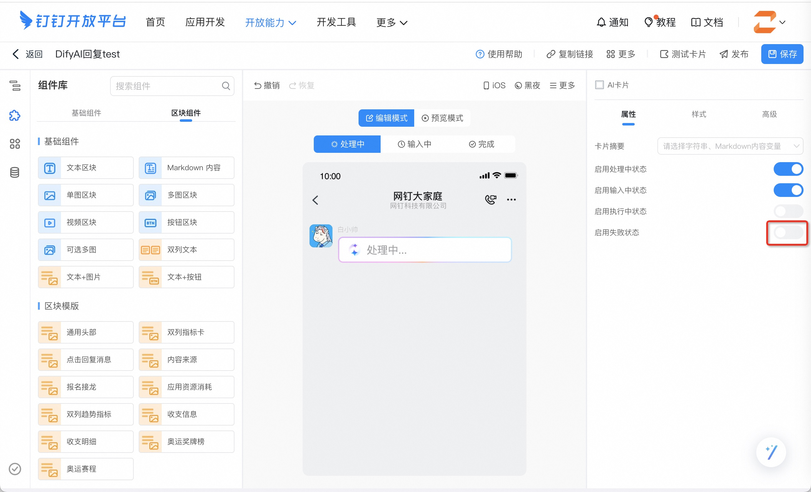

# 让钉钉机器人使用Dify应用进行打字机流式输出

> 作者：zfanswer, [Dify-on-Dingtalk](https://github.com/zfanswer/dify-on-dingtalk)开源项目作者

IM是天然的智能聊天机器人应用场景，校企用户有不少是使用钉钉软件的，通过在企业内部群中添加Dify应用，就可以打造功能强大的数字员工，帮助企业内部人员提质增效。

在本文中，我们将向您展示如何将您的Dify应用和钉钉机器人进行集成，并在钉钉中实现打字机式的流式输出效果，通过使用[Dify-on-Dingtalk](https://github.com/zfanswer/dify-on-dingtalk)这个开源框架，进行简单的配置就可以轻松完成这个集成任务。

先上效果图，也许您就有兴趣继续读下去了。
<figure><figcaption></figcaption></figure>


## 1. 准备工作

1. 安装好Git、Docker、Docker Compose
2. 一个有企业应用开发者权限的钉钉账号
3. 可使用的Dify平台（自部署和官方SaaS服务都可以）
4. 一个您是群主的钉钉群，用作测试

然后我们一步一步详细介绍如何操作。

## 2. 详细步骤

### 2.1. 创建Dify应用

创建Dify应用在本文就不赘述了，可以参考非常详实的Dify官方文档。这里您需要知道的是，本文介绍的方法支持接入的Dify应用包含了Dify目前所有类型。

下图是一个简易方法让您快速识别自己应用的类型，**后续配置时需要明确写明接入应用的类型**。

<figure><figcaption></figcaption></figure>

另外需要说明的是，虽然所有类型的应用都可以接入，但是根据类型不同也有些限制和区别：
- AGENT也属于CHATBOT，聊天助手应用在接入钉钉机器人后是可以保持聊天上下文的（即支持多轮对话），这个容易理解，只有本身在Dify中支持会话的才可以
- COMPLETION（文本生成）、WORKFLOW（纯工作流）应用在创建的时候有限制，接收的用户输入**只能有一个且变量名为`query`**，因为钉钉对话场景下用户输入是单条消息，所以这里只能设置一个变量。

<figure><figcaption></figcaption></figure>
<figure><figcaption></figcaption></figure>

这里我们假设您已经创建好等待接入的Dify应用了，这时就需要查看您这个应用的`访问API`页面，创建该应用的API密钥④，并且记录API服务器访问地址⑤。

<figure><figcaption></figcaption></figure>

所以，在此步骤中您创建了待接入的Dify应用，同时记录该应用的几个重要参数：**应用的类型**、**该应用API秘钥**、**API服务器访问地址**。

### 2.2. 创建钉钉企业应用机器人

登录进入[钉钉开发平台](https://open-dev.dingtalk.com/)，选择合适的组织，进入企业内部应用开发页面，创建一个企业内部应用。

<figure><figcaption></figcaption></figure>

在弹出窗口里填好**应用名称**、**应用描述**，上传应用图标点击保存。然后自动进入应用开发配置界面，通过`添加应用能力`添加机器人能力。

<figure><figcaption></figcaption></figure>

打开机器人配置开关，在下方出现的表单中按您的实际情况填入各必要信息，**在消息接收模式上选择Stream模式**，点击发布。

<figure><figcaption></figcaption></figure>

接下来还需要给这个应用添加一下响应的权限，主要是添加对话中AI卡片相关的权限。

<figure><figcaption></figcaption></figure>

最后到左边栏的应用发布->版本管理与发布->创建新版本，给应用建立一个新版本进行发布。

<figure><figcaption></figcaption></figure>

最后回到`凭证与基础信息`，记录下该应用的`Client ID`和`Client Secret`，此时左上角应用的状态应该是**已发布**，到此完成钉钉机器人的配置。

<figure><figcaption></figcaption></figure>

### 2.3. 钉钉AI卡片配置

为了让钉钉机器人的回复也实现打字机一样的流式输出效果，需要用到钉钉近来针对AI功能开放的AI卡片。

进入钉钉开发者后台，顶部菜单->开放能力->[卡片平台](https://open-dev.dingtalk.com/fe/card)
->新建模版，来新建一个AI卡片模板，填入您喜欢的模版名称，卡片类型选择**消息卡片**，卡片模板场景选择**AI卡片**，并**关联刚才创建的应用**。

<figure><figcaption></figcaption></figure>

点击**创建**后进入卡片编辑页面，这里基本不需要任何改动，如果希望机器人在出错时把具体错误信息也输出出来，可以把`启用失败状态`打开。

<figure><figcaption></figcaption></figure>

最后点击保存，发布，显示“模版发布成功”，然后返回到刚才的模版列表页面，复制**模版ID**，保存下来一会儿会用到。

<figure><figcaption></figcaption></figure>

## 3. 部署Dify-on-Dingtalk

### 3.1. 下载Dify-on-Dingtalk项目代码

```shell
git clone https://github.com/zfanswer/dify-on-dingtalk.git
# 有网络问题的可以从gitee镜像仓库拉取
# git clone https://gitee.com/zfanswer/dify-on-dingtalk.git
```

### 3.2. 填写配置文件

```shell
cd dify-on-dingtalk
# 将配置文件示例拷贝到docker文件夹中
cd docker
cp ../.env.example .env
cp ../.bots.yaml.example .bots.yaml
# 分别修改.env和.bots.yaml文件，配置好所需参数。
```

本文中使用docker来演示如何快速启动服务，如果需要用源代码启动服务，请参考代码中[README.md](https://github.com/zfanswer/dify-on-dingtalk/blob/main/README.md#env%E9%85%8D%E7%BD%AE%E8%AF%B4%E6%98%8E)文件，两个文件的参数配置可参考其中的参数说明，也可按下边简易配置。

`.env`文件主要是配置全局变量的，内容示例如下：
```shell
# 日志级别
LOG_LEVEL=INFO
# 默认每个机器人后台监听线程数，调大可加大可问答并发
# 不过不要太大根据cpu配置适当调整
DEFAULT_MAX_WORKERS=2
# Dify API服务器访问地址，上文2.1.步骤里记录的
DIFY_OPEN_API_URL="https://api.dify.ai/v1"
# 用户各自上下文维持时间，默认 15 minutes，只对chatbot app有效
DIFY_CONVERSATION_REMAIN_TIME=15
# 钉钉AI卡片模版ID，上文2.3.步骤里记录的
DINGTALK_AI_CARD_TEMPLATE_ID="<your-dingtalk-ai-card-temp-id>"
```

`.bots.yaml`文件主要是配置钉钉机器人和Dify应用的绑定关系，内容示例配置如下：
```yaml
bots:
  - name: 问答助手
    # 钉钉应用凭证信息，上文2.2.步骤里记录的
    dingtalk_app_client_id: <your-dingtalk-app-client-id>
    dingtalk_app_client_secret: <your-dingtalk-app-client-secret>
    # Dify应用类型，上文2.1.开头提到的
    dify_app_type: <chatbot or completion or workflow>
    # Dify应用API密钥，上文2.1.步骤里记录的
    dify_app_api_key: <your-dify-api-key-per-app>
    # 目前是固定值，不用动
    handler: DifyAiCardBotHandler
  - name: 问答助手2
    xxx以下略xxx
```
可以看到，在文件中通过添加一组新的bot设定，是支持一次性配置多个机器人和Dify应用绑定的，这是为了用于比如企业内部人事、法务、代码助手等需要多个机器人后边配置不同的Dify应用。不过需要注意的是，不要把同一个钉钉机器人绑定不同的Dify应用，不然具体调用哪个Dify应用来回答是随机的。


### 3.3. 启动docker容器

通过如下命令启动docker容器，

```shell
# 假设现在pwd是在docker文件夹下
docker compose up -d
```

待容器启动后可以通过`docker logs <容器ID>`查看服务日志确认服务是否正常启动，出现如下日志且没有报错即为正常。

```shell
2024-08-20 18:16:42.019 | INFO     | __main__:run:33 - 待启动机器人数量：1, 预计使用最大线程数：1
2024-08-20 18:16:42.019 | INFO     | __main__:run:37 - 启动第1个机器人：agent_chatbot
2024-08-20 18:16:42.021 | INFO     | dingtalk_stream.stream:open_connection:131 - open connection, url=https://api.dingtalk.com/v1.0/gateway/connections/open
2024-08-20 18:16:42.314 | INFO     | dingtalk_stream.stream:start:72 - endpoint is %s
```

## 4. 实际对话测试

### 4.1. 将机器人添加进群聊

从群设置中找到创建的钉钉机器人，添加进群，即可开始在群众@机器人进行对话，该示例图片中是使用了Dify应用的标注功能实现关键字help的固定输出。

<figure><figcaption></figcaption></figure>

### 4.2. 与机器人进行私聊

与机器人进行私聊有两种方法：
1. 在群聊中左键机器人头像，选择发送消息进入私聊界面；
2. 在搜索框中搜索机器人名称，在功能分类下找到机器人，点击进入私聊界面；

私聊界面中直接对话即可，不需要@了。
<figure><figcaption></figcaption></figure>

## 5. 后记

到此为止，Dify应用在钉钉上的集成已经完成，希望本文给你带来了帮助。

如果你对Dify-on-Dingtalk的功能还有其他需求和期待，欢迎对该项目进行贡献。
